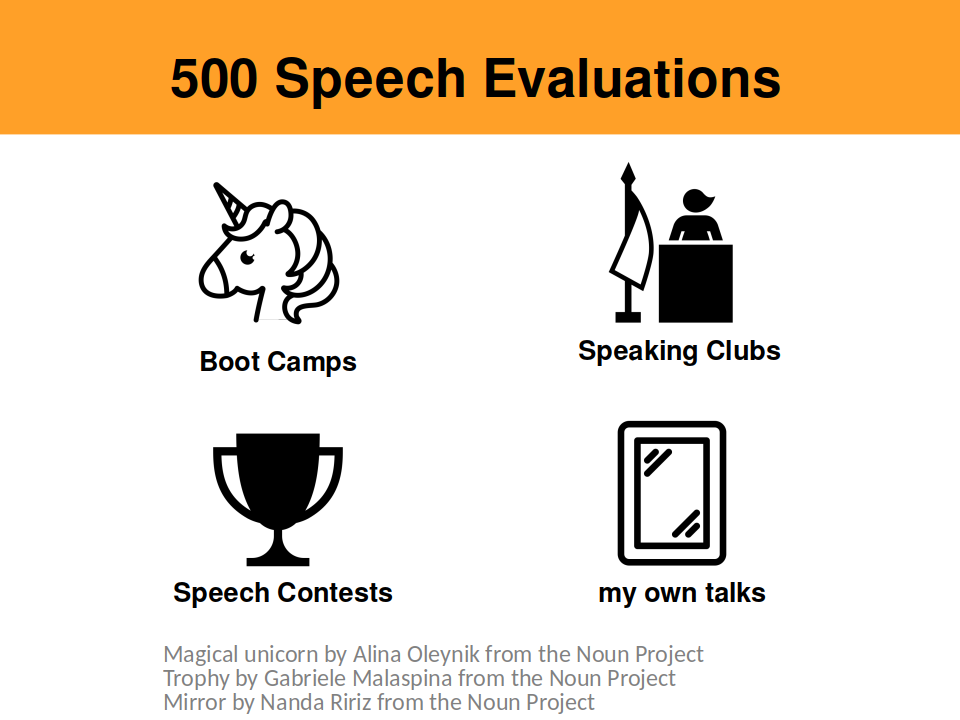
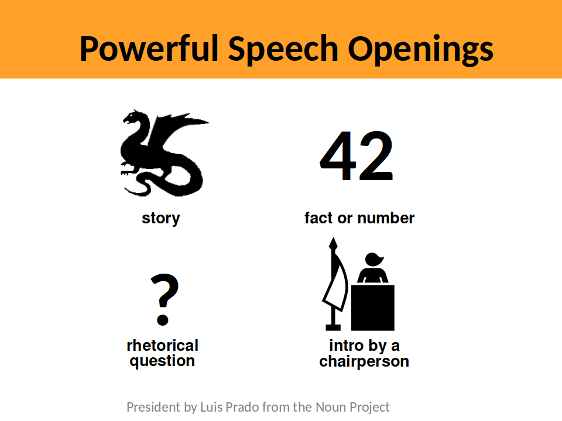
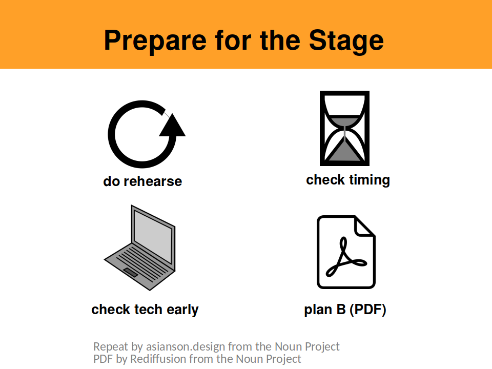

# Lessons from 500 Public Speeches

**Dr. Kristian Rother** (`kristian@spiced-academy.com`)

Take home messages from my talk at DSSG on Apr.20th '18 

----

## Where to evaluate 500 speeches?

* Speaking club: [Berliner.Rhetorik.Salon](http://rhetorik.salon)

----

## Problem #1: How to begin?

**Other suggestions:** Quote, activity or a provocative statement

----

## Problem #2: What content to show?

* Gold Standard: [Hans Rosling, Population Growth Box by Box](https://www.youtube.com/watch?v=fTznEIZRkLg)

----

## Problem #3: How to prevent disasters?

* [John Zimmers Checklist](https://mannerofspeaking.files.wordpress.com/2011/11/a-public-speakers-checklist-version-3.pdf)

**I wish you successful presentations!**
