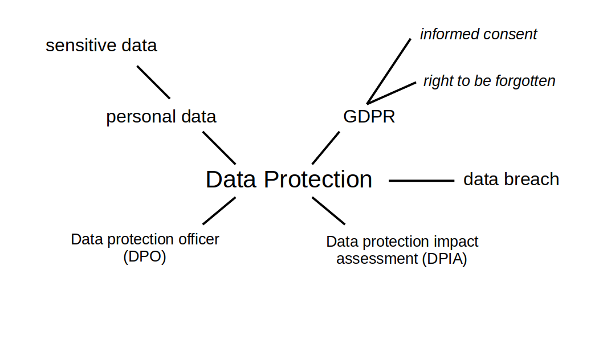

# Data Protection Fundamentals

**a workshop for big and small groups**

## Goal

**Participants become aware of data protection in their organisation.**

During the workshop, participants learn fundamental vocabulary about GDPR.
The common experience during the exercise helps them to communicate GDPR issues together in the future.
The workshop does not provide legal advice. This has to be stated clearly.

----

## License

(c) 2022 Dr. Kristian Rother

Available under the conditions of the Creative Commons Attribution License 4.0 (see [https://creativecommons.org/licenses/by/4.0/](https://creativecommons.org/licenses/by/4.0/)

The images of three people were taken from their respective Wikipedia pages.

The material here was created so that you can use it to run your own data protection workshops.
Feedback is appreciated! Contact me at `kristian.rother@posteo.de`.

----

## Lesson Plan

==== =========================== ====
step name                        time
==== =========================== ====
1    Welcome                     2'
2    Data Protection Quiz        25'
3    Go through answers          25'
4    Mind Map                    5'
5    Reflection questions        25'
6    Next steps                  5'
==== =========================== ====

The timing depends on the group and may vary.
If you keep an eye on the clock strictly, you can finish within 90'.
With an engaged group, the entire workshop may last 2 hours easily.

----

## 1. Welcome

Say hi to the participants and explain the goal of the workshop.
Do not spend more than 2 minutes here, because you want the group to get going fast.

## 2. Data Protection Quiz

You need to have the quiz printed for the participants or a way to give the PDF to online participants.
If you use a print, do not tack the pages together. Do not use two-sided printing.
Use the following order:

* announce the task: complete the quiz as a team
* announce the time limit: 20 minutes is sufficient for most groups
* randomly split the participants into groups of 3-4 people.
* GO!
* inform the participants 5, 2 and 1 minute before time runs out

You might encourage people to move to different rooms to work on the tasks.
If you have a big room, different corners will do.

## 3. Go through answers

Let each team give their answers to another team.
Ask them to mark points.
Go through the quesions one by one.
Ask the participants for suggestions, read out the correct ones.
You can take some time to answer factual questions but do not linger around for discussions.

**when you are done you might want to take a short break, especially in an online setting.**

## 4. Mind Map

To summarize the learnings, display seven fundamental concepts.
Much of GDPR revolves around these:

- personal data
- consent
- right to be forgotten
- data breach
- sensitive data
- data protection officer (DPO)
- data privacy impact assessment (DPIA)

It makes sense to display them as a mind map or write them on a whiteboard/flipchart.
Probably you can make a more beautiful one than this (**Pull Requests appreciated!**):

## 5. Reflection Questions

Conduct a **Lean Coffee** session to discuss a few practical questions.
You find a list of questions below and in the accompanied presentation (for printing!).
Pick a topic, discuss it for five minutes, proceed to the next until you run out of time.

* Pick 10 of the reflection questions below.
* Display them simultaneously. 
* quick vote for priorities (participants may vote on any number of questions)
* discuss a question for 5 minutes
* proceed to the next one or vote to extend by another 5 minutes

## 6. Next steps

To cleanly close the workshop, ask each participant for their impressions and what next steps they would take to improve data protection.

----

## Links for further reading

Share these with participants afterwards:

* [easy to read summary](https://ec.europa.eu/justice/smedataprotect/index_en.htm)
* [more detailed guide](https://www.pandectes.io/blog/gdpr-in-germany-what-you-need-to-know-in-2022/)
* [full legal text](https://gdpr-info.eu/)
* [GDPR fine examples](https://www.privacyaffairs.com/gdpr-fines/)

----

## Answers to the quiz:

#### Question 1

Participants can figure these out by themselves.

#### Question 2

- Richard Nixon
- Constanze Kurz
- Edward Snowden

### Question 3

- DATENSCHUTZGRUNDVERORDNUNG
- DATA BREACH
- GENERAL DATA PROTECTION REGULATION
- ANONYMIZATION
- DATA PRIVACY IMPACT ASSESSMENT
- DATA PROTECTION OFFICER

#### Question 3

Generally anything that allows to uniquely identify a person is personal data:

- name
- address
- phone
- email
- income
- location
- photographs

Some data require special protection:

racial or ethnic origin, political opinions, religious or philosophical beliefs, unemployment, trade union membership, the processing of genetic data, biometric data for the purpose of uniquely identifying a natural person, data concerning health or data concerning a natural person’s sex life or sexual orientation shall be prohibited.

### Question 4

a) True
b) False
c) False
d) True
e) True
f) True
g) True
h) False
i) True
j) False, 16 years
k) True

### Question 5

Amazon failed to get sufficient cookie consent on its website after being fined for similar issues the year before 746 M€ 

H & M recorded obligatory online meetings of several hundred employees after they returned from vacations or sick leave, the meetings contained details from their private lives 35 M€

Marriott had their customer database hacked, exposing names, addresses and passport numbers of guests 20 M€

The VfB Stuttgart was resposible for a negligent breach of data protection accountability but assisted in the investigation and responed by their own initiative 300,000€

A private person took images of vehicles and sent the photographs via unecrypted email to report violations of road traffic regulations (Strassenverkehrsordnung) 200 €

A police officer repeatedly accessed a police database for private purposes 1800 €

A company used outdated web apps that did not receive security updates and passwords were not kept in secure enoughplaces, as found during a security audit after a data breach. 65,000 €

Two 19y olds caught having sex at a swimming pool and behaving verbally dismissive to the pool attendant, police officers and the judge (this was kept for comparison, it is technically not a data privacy violation although plenty of private information was disclosed)

#### Question 6

* minimum fine: 200 €
* maximum fine: 746 M€

In case of involuntary disclosure you have 72 hours to tell the data subjects.
The fine for non-compliance is max(€20 million, 4% of global revenue) plus compensation for damage.

----

## Questions for discussion in text form

#### Careful handling of data

- Could you use your personal USB drive to backup a spreadsheet with customer data?
- You are working on a spreadsheet with customer data. You need to go to the bathroom. How to avoid a data breach?
- Your company laptop gets stolen. There was a spreadsheet with customers names on it. What do you need to do?

#### Access Control

- An employer asks who of their customers is currently on cancer treatment. You have access to the information. What do you tell them?
- Should employers be able to browse customer records across departments?
- An employee with access to the customer database leaves. What do you need to take care of?
- What problems could result from unencrypted communication in the Wifi?

#### Consent

- A colleague asks you to connect them to a former employee. How can you do this in a GDPR-safe way?
- A former customer asks to be deleted. Do you have to delete them from the database backups as well?
- A former employee claims they did not consent to having their picture on the company homepage. What should you do?

#### Reflection

- Where is personal data kept in your organization?
- What data protection challenges do you see at your organization?
- What could be done to improve data protection?
